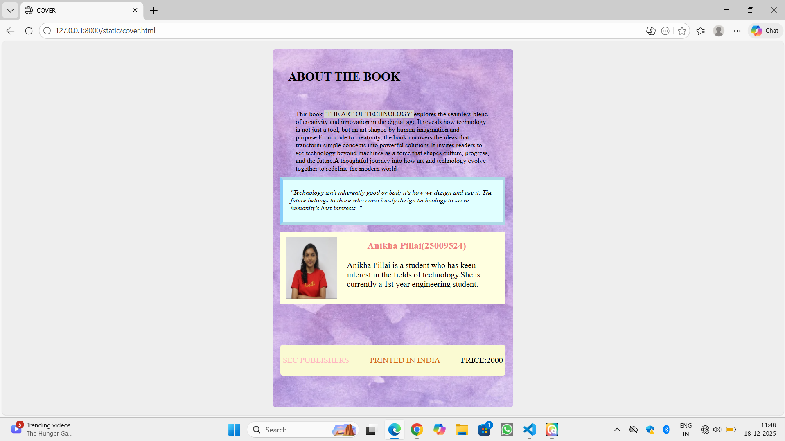

# Ex.05 Book Cover Page Design
## Date:18-12-2025

## AIM:
To design a book back cover page using HTML and CSS.

## DESIGN STEPS:

### Step 1:
Create a Django Admin project.

### Step 2:
Create an app in the Django interface.

### Step 3:
Create a folder named 'static' in the app folder.

### Step 4:
Create a new HTML file in the static folder.

### Step 5:
Write the HTML code with relevant CSS properties.

### Step 6:
Choose the appropriate style and color scheme.

### Step 7:
Insert the images in their appropriate places.

### Step 8:
Publish the website in the LocalHost.

## PROGRAM:
cover.html
```
<html>
    <head>
        <title> COVER </title>
        <link href="cover.css" rel="stylesheet">
    </head>
    <body>
        <div class="cover">
            <div class="container">
            <h2><b>ABOUT THE BOOK </b></h2>
            <hr>
            <p class="about"><font size="2">This book <span class="highlight"> "THE ART OF TECHNOLOGY"</span>explores the seamless blend of creativity and innovation in the digital age.It reveals how technology is not just a tool, but an art shaped by human imagination and purpose.From code to creativity, the book uncovers the ideas that transform simple concepts into powerful solutions.It invites readers to see technology beyond machines as a force that shapes culture, progress, and the future.A thoughtful journey into how art and technology evolve together to redefine the modern world</font></p>
            </div>
            <div class="thought">
                <br>
                <br>
                <p><font size="2"><i>"Technology isn't inherently good or bad; it's how we design and use it. The future belongs to those who consciously design technology to serve humanity's best interests. " </i></font></p>

            </div>
            <div class="item">
                
                <div class="author">
                    <h3>Anikha Pillai(25009524)</h3>
                    <p class="words">Anikha Pillai is a student who has keen interest in the fields of technology.She is currently a 1st year engineering student.</p>
                </div>
            </div>
            <div class="footer">
               
                <p class="publishers">SEC PUBLISHERS</p>
                <p class="location">PRINTED IN INDIA</p>
                
                <p class="price">PRICE:2000</p>
                
            </div>
        </div>
        
    </body>
</html>
```
cover.css
```
body {
    margin: 0;
    display: flex;
    justify-content: center;
    align-items: center;
    height: 100vh;
    background: #eee;
}
.cover {
    width: 470px;
    height: 700px;
    background: url("back.png") no-repeat center/cover;
    position: relative;
    border-radius: 6px;
    overflow: hidden;
}
.container {
    position: absolute;
    top: 0%;
    left: 0;
    right: 0;
    padding: 20px 30px;
    color: #000;
    margin-top:0px;
    margin-bottom:100px;
}
hr
{
    border:1px solid;
    color: black;
}
.highlight
{
background-color: lightgray;
}
.about
{
    padding: 15px;
}
.thought
{
margin-top: 250px;
margin-left: 15px;
margin-right:15px;
padding: 3px;
padding-right:15px;
padding-left: 15px;
border-left: 5px solid lightskyblue;
border-right: 5px solid lightblue;
border-bottom: 5px solid lightblue;
border-top: 5px solid lightblue;
display: flex;
background-color:lightcyan;
font:Arial
}
.item
{
display: flex; 
margin-left:15px;
margin-right:15px;
margin-top:15px;
background-color: lightyellow;
padding: 10px;
}
.item img
{
    width:100px;
    height:120px;
}
.words
{
    padding-left: 20px;
    
}
.author h3
{
    color: lightcoral;
    margin-top:5px;
    padding-left:60px;   
}
.footer
{
    margin-top: 80px;
    display: flex;
    background-color: lightgoldenrodyellow;
    color:chocolate;
    padding:5px;
    justify-content: space-between;
    border-radius: 5px;
    margin-left:15px;
    margin-right:15px;
    text-align: left;
}


.publishers
{
    color: lightpink;
    text-align: left;
}
.location
{ 
    text-align:center
    
}

.price
{
    color:black;
}

```


## OUTPUT:


## RESULT:
The program for designing book back cover page using HTML and CSS is completed successfully.
